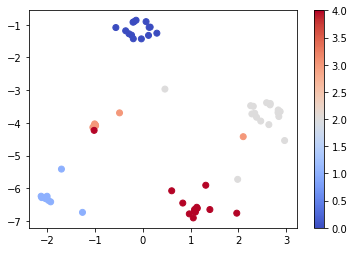

# Identical-Image-Retrieval

## Description
This project presents a simple framework to retrieve images similar to a query image using Deep Learning. The framework is as follows:

* Train a CNN model (A) on a set of labeled images with Triplet Loss (I used this one).
* Use the trained CNN model (A) to extract features from the validation set.
* Train a kNN model (B) on these extracted features with k set to the number of neighbors wanted.
* Grab an image (I) from the validation set and extract its features using the same CNN model (A).
* Use the same kNN model (B) to calculate the nearest neighbors of I.

I experimented with the Flower Dataset.

## Model Used

I fine-tuned pre-trained models for minimizing the Triplet Loss. I experimented with the following pre-trained models:

* BigTransfer Model (also referred to as BiT) which is essentially a ResNet but pre-trained on a larger dataset with additional modifications.

### Train Graph

### Visualization of the embedding space

## Results

